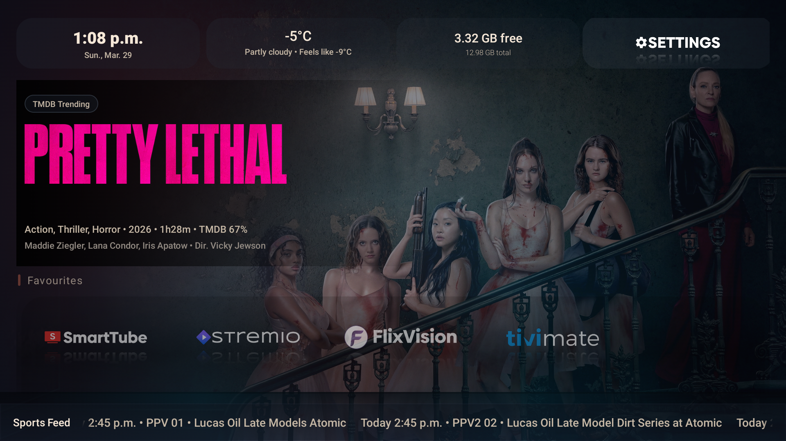

# FireLauncher

FireLauncher is a custom Android TV / Fire TV launcher focused on fast media access, clean TV-first navigation, curated app art, rotating cinematic backgrounds, and live sports feed awareness.

The project is currently in active beta and is being iterated in public test builds.

Download the latest public build at [firelauncher.3hpm.ca](https://firelauncher.3hpm.ca).

## Screenshot



## What It Does

FireLauncher replaces the default app-grid feel with a living home screen built for TV use:

- a large featured hero area with rotating artwork
- floating app art instead of heavy boxy launcher cards
- fast D-pad navigation
- sports-aware ticker data in the user’s local time
- simple setup backup and restore
- curated app sections instead of a generic all-apps wall

## Core Features

### Home Screen

- TV-first home screen built for remote navigation
- featured hero area with TMDB-backed movie and TV artwork
- top widgets for time, weather, storage, and quick settings
- floating transparent app art with reflection-style focus feedback
- curated rails for `Favourites`, `Recently Used`, `TV Apps`, `Free VOD`, `Paid Apps`, `Utilities`, and `Uncategorized`
- `Uncategorized` catches matched apps that are not yet assigned to a primary category

### App Library

- curated icon/banner pack for supported apps
- app-specific art preferred over generic system icons where available
- fallback to app banner or icon when no custom art exists
- `See All Apps` browser for overflow and management
- hide apps from Home
- restore hidden apps back to Home
- add or remove favourites
- assign apps to categories
- create and manage custom categories

### Wallpapers and Hero Content

- rotating wallpapers from:
  - TMDB Trending
  - TMDB Trending Movies
  - TMDB Trending TV
  - TMDB Popular Movies
  - TMDB Popular TV
  - NASA
  - Reddit EarthPorn
  - local wallpaper folder
  - fixed local image
- wallpaper shuffle
- change-on-open option
- manual wallpaper refresh
- TMDB hero metadata including title art, genres, runtime, rating, cast, director, and overview when available

### Weather

- weather widget on the home screen
- Celsius or Fahrenheit toggle
- manual weather location override using postal code, ZIP, or city
- automatic fallback to IP-based lookup if no override is set

### Sports Ticker

- local-time conversion based on the user’s device timezone
- supports:
  - `PPV 1`
  - `PPV 2`
  - `NHL`
  - `MLB`
  - `NBA`
- `LIVE NOW` view for events started within the last 2 hours
- `UPCOMING` view for future events
- compact sports guide popup from the ticker

### Settings and Backup

- tabbed settings layout for a cleaner TV-style settings experience
- grouped settings for `Appearance`, `Weather`, `Apps`, and `Backup`
- export setup
- import setup
- backup includes app/home preferences, categories, wallpaper settings, and weather settings

## Sports Feed Publisher

This repo also includes a lightweight hosted publisher tool in [`ppv_admin/`](ppv_admin/) for building and publishing sports feed JSON files.

Supported feed outputs:

- `events_ppv_1.json`
- `events_ppv_2.json`
- `events_nhl.json`
- `events_mlb.json`
- `events_nba.json`

The launcher consumes those feeds and converts times into the user’s local device timezone.

## Download Site

The project includes a static release site in [`ppv_download_site/`](ppv_download_site/).

Current public site:

- [firelauncher.3hpm.ca](https://firelauncher.3hpm.ca)

The site is deployed with GitHub Pages and updated through GitHub Actions when a release workflow is run.

## Platform Notes

- Package name: `com.threehpm.firelauncher`
- Minimum SDK: `24`
- Target SDK: `34`
- Designed for Android TV and Fire TV style devices

Important Fire TV note:

- FireLauncher can register as a `HOME` activity, but Amazon Fire TV devices do not always allow third-party launchers to become the true default launcher on newer firmware. FireLauncher still works well as a launcher app and test shell, but system-level replacement behavior can vary by device and Fire OS version.

## Local Setup

### Requirements

- Android Studio
- JDK 17
- Android SDK 34

### Optional Local Secrets

Create or update:

- `local.properties`
- `keystore.properties`

Used values include:

- `threehpm.tmdbApiKey` in `local.properties`
- signing values in `keystore.properties`

### Build Debug

```powershell
.\gradlew.bat assembleDebug
```

### Build Release

```powershell
.\gradlew.bat assembleRelease
```

Release APK output:

```text
app/build/outputs/apk/release/app-release.apk
```

## GitHub Release Flow

This repo includes a manual GitHub Actions workflow that:

- builds the signed release APK
- creates or updates a GitHub Release
- uploads the APK and checksum file
- regenerates the release metadata for the website
- deploys the updated site to GitHub Pages

Required GitHub repository secrets:

- `ANDROID_KEYSTORE_BASE64`
- `ANDROID_KEYSTORE_PASSWORD`
- `ANDROID_KEY_ALIAS`
- `ANDROID_KEY_PASSWORD`
- optional: `TMDB_API_KEY`
- optional: `WEATHER_API_KEY`

The workflow is manual by design. Pushing code does not automatically publish a new APK. A new public release is only published when the release workflow is run.

## Project Structure

```text
app/                 Android launcher app
ppv_admin/           Hosted sports feed publisher
ppv_download_site/   Static release/download website
.github/workflows/   GitHub Actions workflows
signing/             Local signing assets
```

## Current Direction

FireLauncher is aimed at users who want:

- a cleaner TV home experience
- better media app presentation
- sports-aware glanceable information
- customizable wallpaper rotation
- practical remote-friendly navigation

The project is still moving quickly, so public builds should be treated as active beta releases rather than frozen stable builds.
